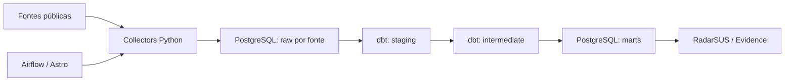

# Raio-X Municipal — Engenharia de Dados

Pipeline de integração de dados públicos de saúde para construir indicadores municipais com origem rastreável. Reúne collectors Python independentes, DAGs Apache Airflow e modelos dbt para transformar fontes dispersas em dimensões, fatos e marts consumidos pelo RadarSUS.

## O que o projeto entrega

- Cadastro de municípios e população estimada do IBGE.
- Rede de estabelecimentos e equipes de atenção primária do CNES.
- Produção ambulatorial (SIA), internações (SIH), óbitos (SIM) e nascidos vivos (SINASC).
- Indicadores e cadastro vinculado da atenção primária via SISAB.
- Repasses do FNS, financiamento via Portal da Transparência e RREO Anexo 14 via SICONFI/Tesouro, usado na análise de financiamento originalmente prevista para SIOPS.
- Marts de cobertura APS, internações por condições sensíveis à atenção primária (ICSAP), financiamento, histórico da rede, comparação entre municípios do RJ e alertas.

A presença de um collector não significa cobertura nacional ou atualização contínua: vários entrypoints têm UF, município ou período definidos no código. Consulte [ROADMAP.md](ROADMAP.md) e [ROADMAP_DBT.md](ROADMAP_DBT.md) para escopo, decisões e limitações por fonte.

## Arquitetura



Os collectors não dependem de Airflow. As DAGs chamam seus entrypoints; o dbt concentra as regras analíticas. O PostgreSQL dos dados é externo ao stack Astro. O PostgreSQL iniciado pelo Astro atende apenas aos metadados do Airflow.

A DAG `dbt_transform` executa `seed → run → test` em um ambiente Python isolado, criado com `uv` dentro do container. As DAGs de coleta e transformação têm disparo manual; não há encadeamento automático completo entre todas as fontes e o dbt.

## Stack e estrutura

Python, requests, psycopg, pysus, Apache Airflow (Astro Runtime), dbt e PostgreSQL.

| Caminho | Responsabilidade |
|---|---|
| [include/collectors/](include/collectors/) | Clientes, parsers, persistência e entrypoints por fonte |
| [dags/](dags/) | Orquestração e transformação dbt |
| [dbt/](dbt/) | Models, seeds, macros, profiles e testes de dados |
| [tests/](tests/) | Testes dos collectors e das DAGs |
| [docs/](docs/) | Fontes e guia de implementação de collectors |

## Executar localmente

Pré-requisitos: Docker com Compose, Astro CLI e um PostgreSQL dedicado aos dados. Para executar collectors e testes fora do Airflow, use Python compatível com as dependências de [requirements.txt](requirements.txt).

```bash
git clone https://github.com/Moscarde/raio-x-engenharia.git
cd raio-x-engenharia
cp .env.example .env
```

Preencha `POSTGRES_HOST`, `POSTGRES_PORT`, `POSTGRES_DB`, `POSTGRES_USER` e `POSTGRES_PASSWORD` com uma conexão de desenvolvimento. O usuário precisa criar schemas e tabelas. `PORTAL_TRANSPARENCIA_API_KEY` é necessária apenas para o collector desse portal.

```bash
astro dev start
```

Use a URL da interface informada pelo Astro. O [docker-compose.override.yml](docker-compose.override.yml) define `POSTGRES_HOST=host.docker.internal` para o scheduler, adequado para um banco acessível pelo host Docker; ajuste esse override se o banco estiver em outro servidor. `localhost` dentro do container não aponta para o host.

Para uma primeira coleta pequena, dispare `raw_ibge` na interface do Airflow. Ela carrega o cadastro de municípios em `raw_ibge.municipios`. Antes de disparar outras DAGs, revise o escopo do collector correspondente. Execute `dbt_transform` depois das cargas necessárias aos models: só o cadastro IBGE não fornece todas as fontes exigidas pelo projeto dbt.

### Collectors e dbt fora do Airflow

```bash
python3 -m venv .venv
source .venv/bin/activate
pip install -r requirements.txt -r requirements-dev.txt
python -m include.collectors.ibge.run_municipios
```

Esse entrypoint carrega o `.env`. O dbt lê `POSTGRES_*` do ambiente do processo; exporte os valores de desenvolvimento antes de executar os comandos abaixo. Um `.env` com atribuições válidas para shell pode ser carregado assim:

```bash
set -a
source .env
set +a
dbt debug --project-dir dbt --profiles-dir dbt
dbt seed --project-dir dbt --profiles-dir dbt
dbt run --project-dir dbt --profiles-dir dbt
dbt test --project-dir dbt --profiles-dir dbt
```

Mantenha dbt fora do ambiente Python do próprio Airflow para evitar conflitos de dependências.

## Verificação

```bash
pytest
```

O [pytest.ini](pytest.ini) limita o comando local aos testes dos collectors, sem exigir Airflow. Para incluir os testes de DAGs no ambiente Astro:

```bash
astro dev pytest
```

Os testes de dados dbt exigem as tabelas de origem carregadas. Eles não são substituídos pelos testes unitários dos collectors.

## Documentação e limites

- [ROADMAP.md](ROADMAP.md): escopo e estado das fontes.
- [ROADMAP_DBT.md](ROADMAP_DBT.md): grão dos models, regras e decisões analíticas.
- [docs/fontes.md](docs/fontes.md): rotas de acesso e formatos.
- [docs/COLLECTOR_TEMPLATE.md](docs/COLLECTOR_TEMPLATE.md): padrão para adicionar uma fonte.

Fontes públicas podem mudar de formato, atrasar competências ou apresentar cobertura incompleta. Compare indicadores considerando período, granularidade e metodologia. Não versione `.env`, credenciais, dumps ou dados pessoais.

## Projetos relacionados

Este repositório faz parte do **Raio-X Municipal**, iniciativa independente de integração e análise de dados públicos de saúde. Os demais componentes são:

| Repositório | Papel no ecossistema |
|---|---|
| [raio-x-database](https://github.com/Moscarde/raio-x-database) | Infraestrutura PostgreSQL, persistência, roles e rotinas de backup e restauração (repositório privado). |
| [raio-x-front](https://github.com/Moscarde/raio-x-front) | RadarSUS: aplicação Next.js para explorar indicadores e comparar municípios. |
| [raio-x-dash-evidence-dev](https://github.com/Moscarde/raio-x-dash-evidence-dev) | Protótipo anterior de apresentação analítica com Evidence.dev, Markdown e SQL. |
| [raio-x-lake](https://github.com/Moscarde/raio-x-lake) | Infraestrutura MinIO para object storage; a integração com o pipeline atual não está implementada. |

O fluxo implementado é fontes públicas → collectors/Airflow → PostgreSQL raw → dbt → marts PostgreSQL → apresentação. O MinIO é uma infraestrutura separada e não é requisito para executar o pipeline atual.
